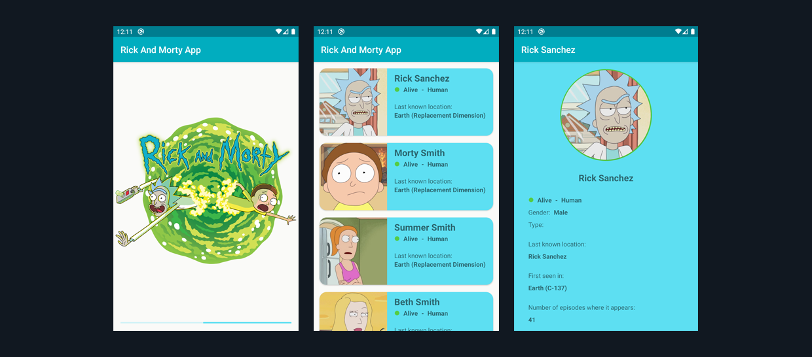

# [Rick and Morty APP]


Proyecto de Android con Kotlin usando el patrón MVVM donde implemento algunas librerías de [Android Jetpack](https://developer.android.com/jetpack) 
como [Navigation](https://developer.android.com/jetpack/androidx/releases/navigation) y [Databinding](https://developer.android.com/jetpack/androidx/releases/databinding); 
para la creación de una aplicación sencilla donde consumo datos de la [The Rick and Morty API](https://rickandmortyapi.com/) con [Retrofit](https://square.github.io/retrofit/), 
Glide, GSON, Coroutines.

### Dependencias

- Kotlin
- Android KTX [version: '2.3.0'](https://developer.android.com/kotlin/ktx)
- Retrofit 2 [version: '2.9.0'](https://square.github.io/retrofit/)
- Gson [version: '2.8.6'](https://github.com/google/gson)
- Glide [version: '4.11.0'](https://github.com/bumptech/glide)

### Arquitectura

Este proyecto esta basado en la arquitectura MVVM (Model View ViewModel).
También tenemos que los componentes de arquitectura como el Data Binding están modelados con dicho patrón.


[Guía de arquitectura android google](https://developer.android.com/jetpack/docs/guide)




## Uso de Retrofit y Gson

Para utilizar la librería en el proyecto tienen que agregar en el archivo `build.gradle` de tu modulo lo siguiente en `dependencies`:
```gradle
dependencies {
  ...
    // retrofit
    implementation 'com.squareup.retrofit2:retrofit:2.9.0'
    implementation 'com.squareup.retrofit2:converter-gson:2.9.0'
  
    // gson
    implementation 'com.google.code.gson:gson:2.8.6'
  ...
}
```

Ahora procedemos a crear nuestro directorio `network` donde vamos a crear nuestro archivo Api Service 
que para este caso se llamara `RickAndMortyApiService` una vez creado el archivo creamos una constante
 la cual tendrá la ruta de la API
```kt
    private const val BASE_URL = "https://rickandmortyapi.com/api/"
```
Ahora procedemos a crear una instancia de Retrofit el cual le pasamos `GsonConverterFactory.create()` la 
cual se encargara automáticamente de mapear los datos JSON a los objetos kt o Java y luego le pasamos 
la ruta anteriormente creada
```kt
    private val retrofit = Retrofit.Builder()
        .addConverterFactory(GsonConverterFactory.create())
        .baseUrl(BASE_URL)
        .build()
```

Creamos nuestra Interface la cual tendrá nuestra petición `GET` a la API la cual esta formada por:
`@GET("character/")` para obtener los personajes la API dispone de solicitudes GET mediante `character/`.
`@Query("page") type: Int` para pasar parametros por ruta, que en este caso es el numero de la pagina que queremos consultar `character/?page=2`
`Response<DataRickAndMorty>` y le indicamos que nos devuelva un respuesta de tipo `DataRickAndMorty` para maquetar los datos JSON
```kt
    interface RickAndMortyApiService {    
        @GET("character/")
        suspend fun getData(@Query("page") type: Int):
                Response<DataRickAndMorty>
    }
```
Y ya de ultimo creamos nuestro objeto para acceder a nuestro servicio con retrofit y consultar los datos
```kt
    object RickAndMortyApi {
        val retrofitService : RickAndMortyApiService by lazy {
            retrofit.create(RickAndMortyApiService::class.java)
        }
    }
```

Para la consulta de datos va a depender mucho de nuestra API como este estructurada puede manejar diferente 
tipo de peticiones como son GET, POST, PUT, DELETE, PATCH siempre revisar la documentación de la API para la 
implementación [Rick and Morty API Docs](https://rickandmortyapi.com/documentation/)

Ahora procedemos a consumir los datos desde nuestro `ViewModel` lo recomendó es manejar el patrón `Repository Pattern` 
donde creamos un archivo `repository` donde tendremos esta lógica separa del `ViewModel` pero este ejemplo lo manejaremos desde `ViewModel`.

Creamos nuestro método `getData(page: Int)` en el ViewModel donde consultamos los datos y capturamos los errores de la petición
```kt
    private suspend fun getData(page: Int) {
            try {
                val response = RickAndMortyApi.retrofitService.getData(page)
                if (response.isSuccessful) {
                    _rickAndMortyData.value = response.body()?.results
                } else {
                    _status.value = RickAndMortyStatus.ERROR
                    _rickAndMortyData.value = ArrayList()
                }    
            } catch (e: UnknownHostException) {
                //No hay conexión a Internet o el host no está disponible
                _status.value = RickAndMortyStatus.ERROR
                _rickAndMortyData.value = ArrayList()
            } catch (e: SocketTimeoutException) {
                //Se agota el tiempo de espera
                _status.value = RickAndMortyStatus.ERROR
                _rickAndMortyData.value = ArrayList()
            } catch (e: Exception) {
                _status.value = RickAndMortyStatus.ERROR
                _rickAndMortyData.value = ArrayList()
            }
    }
```

Para ejecutar la consulta automáticamente cuando se carga la vista la iniciamos en nuestro constructor secundario o bloque `init` de la siguiente manera
```kt
    private var viewModelJob = Job()
    private val coroutineScope = CoroutineScope(viewModelJob + Dispatchers.Main)

    init {
        coroutineScope.launch {
            getData(1)
        }
    }
```
Coroutines son una nueva característica del lenguaje Kotlin que nos permite escribir código asincrónico de una manera más idiomática. 
Se predirá decir que las `Coroutines` son una alternativa ligera a los hilos "Las corrutinas proporcionan una forma de evitar bloquear un hilo y reemplazarlo con una operación más económica y controlable"
[Coroutine](https://kotlinlang.org/docs/reference/coroutines-overview.html)
[CoroutineScope](https://kotlin.github.io/kotlinx.coroutines/kotlinx-coroutines-core/kotlinx.coroutines/-coroutine-scope/)


[App Release Dev Trivia APK](release/rick-morty-app.apk)